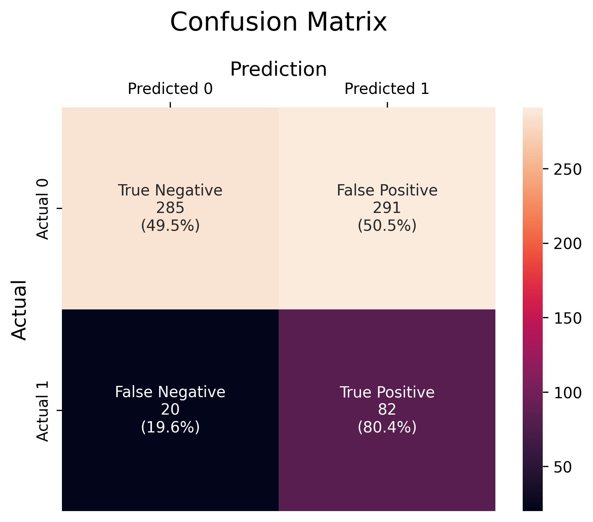
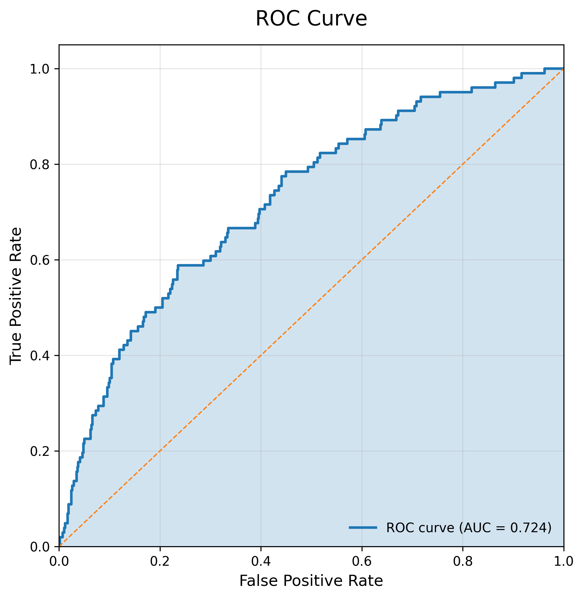

# 10-Year Coronary Heart Disease (CHD) Risk Prediction

An end-to-end logistic regression project predicting the 10-year risk of coronary heart disease (CHD).

## Quick Links
* ➡️ **View the Jupyter Notebook on GitHub**: [chd-risk-prediction-logit.ipynb](https://github.com/acobotas/Heart-Disease-Risk-Prediction/blob/main/notbeook.ipynb)
* **Dataset:** [Cardiovascular Study Dataset on Kaggle](https://www.kaggle.com/datasets/christofel04/cardiovascular-study-dataset-predict-heart-disea)

## Objectives
* Predict 10-year risk of CHD using logistic regression.
* Handle class imbalance using stratified splits and class weighting.
* Optimize model threshold for F2-Score to prioritize recall.
* Perform robust preprocessing and feature engineering based on EDA.

## Methodology
1. Data Cleaning & Preparation  
2. Exploratory Data Analysis (EDA)  
3. Feature Selection & Transformation (log-transform skewed features, remove multicollinear features)  
4. Missing Value Imputation  
5. Train/Test Split (stratified)  
6. Logistic Regression with `class_weight='balanced'`  
7. Threshold Optimization based on F2-Score  
8. Model Evaluation (Recall, F2, ROC-AUC, Confusion Matrix)  

## Threshold Optimization (F2-Score)

Because missing a high-risk patient is more costly than a false alarm, the decision threshold was optimized using the **F2-score**, which prioritizes recall over precision. The optimal threshold was selected based on training-set probabilities.

Lowering the threshold from 0.50 to 0.40 increased the model’s ability to identify at-risk patients while maintaining acceptable precision.

## Model Performance & Evaluation

### Confusion Matrix

The confusion matrix below illustrates model performance on the test set using the optimized threshold. The model favors recall, resulting in fewer false negatives at the expense of increased false positives—an appropriate trade-off for a medical screening task.

### ROC Curve

The ROC curve summarizes the model’s ability to discriminate between classes across all thresholds. Despite threshold tuning for recall, overall separability remains stable.

## Key Insights
* Age, BMI, and systolic BP are strong predictors of CHD.
* Removing multicollinear features improved model stability.
* Log-transforming skewed features increased model performance.
* Optimized threshold increased F2 from 0.487 to 0.525 on the test set.

## Future Improvements
* Use pipelines for preprocessing and modeling.
* Explore alternative models (e.g., XGBoost, LightGBM).
* Perform cost-sensitive threshold tuning based on false positive vs. false negative impact.
* Conduct in-depth analysis on misclassified samples.